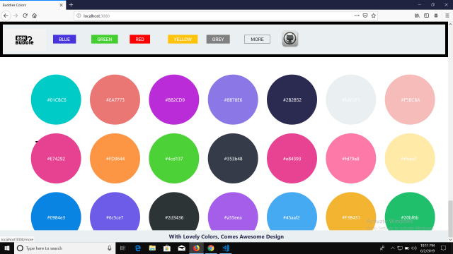

# Color_Picker_Project_in_React_16.13.0
### Click on Circle to copy the color for your Web and Mobile App
### Ask Buddie Open Source Front_End Project

**Pure CSS Modules to get rid of global css Naming**

**CSS Grid for Positioning the Circle div**

**[react-copy-to-clipboard] (https://www.npmjs.com/package/react-copy-to-clipboard)**

**[react-scroll] (https://www.npmjs.com/package/react-scroll)**

**Service Worker for Offline Access**

#### Inspired by:
(http://uicolorpicker.com/)
(https://flatuicolors.com/)
(https://hamrocolor.com/)

#### Everyone is Welcome... 
**Contribute this Project by doing refactor of Source code or by changing UI.**

## Contributors ✨

Thanks goes to these wonderful people ([emoji key](https://allcontributors.org/docs/en/emoji-key)):

<!-- ALL-CONTRIBUTORS-LIST:START - Do not remove or modify this section -->
<!-- prettier-ignore-start -->
<!-- markdownlint-disable -->
<table>
  <tr>
    <td align="center"><a href="https://anuraghazra.github.io/"> <b>Anurag Hazra</b></a> </a> <a href="https://github.com/Alidhuniya/colorPicker/pull/1" title="Reviewed Pull Requests">👀</a> </td>
    <td align="center"><a href="https://alidhuniya.github.io/HTMLCSS-Projects/HTMLCSS-Portfolio/htmlcss-dev/"> <b>Ali Dhuniya</b></a> <a href="https://github.com/Alidhuniya/colorPicker" title="Documentation"><b style="color:white";>Author</b></a></td>
  </tr>
</table>
<!-- markdownlint-enable -->
<!-- prettier-ignore-end -->
<!-- ALL-CONTRIBUTORS-LIST:END -->
